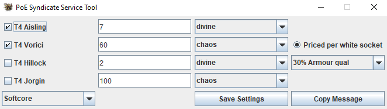

# poe-tft-service-tool
A tool too quickly generate messages to sell Betrayal services on TFT

This is a simple tool to copy messages for services into the clipboard. 
These messages are formated as required and is custom in the \#services-wts-\<current league\> channel on the TFT discord. 

The features are very simple and include, checking which services you have; set prices for them in your desired currency; select your league (idek if hc uses tft. They all live in the same trade channel) and save a basic version of your settings, such that you don't have to set it up again every time.

## UI

The UI of the tool.

## Using the tool

You need to have Java installed, which you can get [here](https://www.java.com/de/download/).

- Download [PoE_Service_Tool.zip](https://github.com/kukumba-poe/poe-tft-service-tool/blob/main/PoE_Service_Tool.zip)
- Extract it at your desired location
- Start the tool by using the executable or jar file

For access from other places simply create a shortcut.
 
