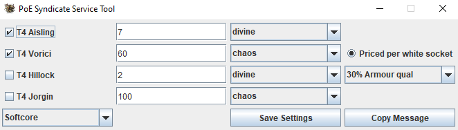

# poe-tft-service-tool
A tool too quickly get messages to sell Betrayel services on TFT

This is a simple tool to copy messages for services into the clipboard. 
These messages are formated as required and is custom in the \#services-wts-\<current league\> channel on the TFT discord. 

The features are very simple and include, checking which services you have; set prices for them in your desired currency; select your league (idek if hc uses tft. They all live in the same trade channel) and save a basic version of your settings, such that you don't have to set it up again every time.

## UI

The UI of the tool.

## Using the tool
To use the tool simply download the [poe-service-tool.zip](poe-service-tool.zip), then extract it and open the executable jar from the folder.
 
